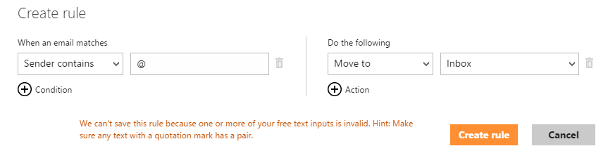
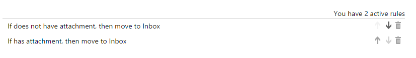

I have just started using the new [Google Inbox](https://inbox.google.com) anddecided that it was time to move all of my current emails to fully take advantage of the new offering.

To do this I needed to move all of my emails from Outlook.com to Gmail. Simple, you might think - and on the face of it, it is quite simple. I decided to go the POP3 route. That is to say that I connected Gmail to my Outlook.com account via POP3, so that it would download all of my emails.

# The Problem

The question then arose, 'Do I want to leave the emails that Outlook.com has moved to my junk folder?' Do I trust Microsoft that much? The answer to this question is no. No, I do not!

So I decided to disable the Outlook.com junk filter to keep all of my emails in the inbox, so that Gmail would retrieve them via POP3. It turned out that this is *not* a feature that Outlook.com provides, but while searching for answers, I did stumble across a thread on [answers.microsoft.com](http://answers.microsoft.com/en-us/outlook_com/forum/osettings-oemailset/is-there-any-way-to-disable-spam-filter-completely/807d742a-a986-4236-95b2-f943e8b527a3?page=1), which got me some of the way there.

The best solution at the time of writing this seemed to be to add the rule:

```
where the senders address contains "@" move it to the inbox
```

Perfect! And it would be, if Outlook.com would allow you to add this rule. Instead it throws back an error:
```
We can 't save this rule because one or more of your free text inputs is invalid. Hint: Make sure any text with a quotation mark has a pair.
```



Simply meaning that you can't use the @ symbol on its own.

# The Solution

The best solution I could come up with is to create 2 rules. One that catches all emails that have an attachment and another to catch all emails that don't have an attachment. Creating these 2 rules should catch any email sent and move it to your inbox. What was strange was that even a rule where you match your email address did not work; surely any email you receive must have been sent to your email address?

You should end up with 2 rules that look like the following.




At this point all incoming email will match one of the above rules and end up in your inbox, effectively disabling the junk filter.