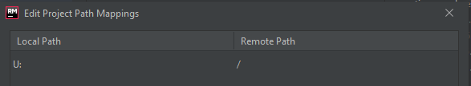

For my Ruby development I have been using Visual Studio Code and WSL 2.

I wanted to move to a more Ruby friendly IDE... RubyMine.

I used this guide from the RubyMine Documentation: [https://www.jetbrains.com/help/ruby/configuring-remote-interpreters-using-wsl.html#wsl_remote](https://www.jetbrains.com/help/ruby/configuring-remote-interpreters-using-wsl.html#wsl_remote)

The problem I had was the mapping between the Windows file system and the Linux one - step 6 in the documentation.

The problem seemed to be that the mappings didn't work when access the UNC shares for WSL 2. For example the UNC path for this blog is `\\wsl\Ubuntu\home\cchild\repos\hardcopy.dev`.

The way around this is to map a network drive to the UNC path and us that for the mappings in RubyMine.

I ended up doing one mapping. 

`U:` --> `/`

Hope this is useful.