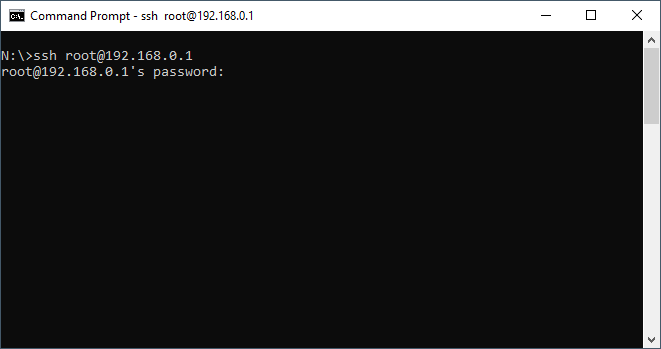

This is the first in a series of posts I am calling "Did You Know".

Did you know that you can now use SSH directly in the Windows command prompt. I did not until just the other day. I normally use [PuTTY](https://www.putty.org), which has always served me well. But it is much easier to use command prompt, especially as I quite often use lots of different machines and I constantly have to re-download PuTTY.

The syntax is very much as you would expect. So to connect to my router at home I use the following

```
ssh root@192.168.0.1
```



You can also specify a different port using the -p flag. For example, to connect to my router using port 4567, you would use the following

```
ssh root@192.168.0.1 -p 4567
```

Simple as that, you can now quickly connect to your Linux machines without the need for PuTTY.
